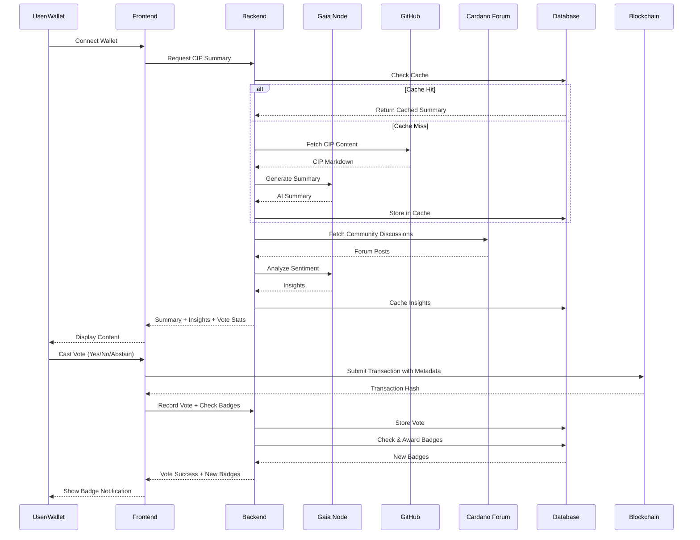

# ProposalPal AI - AI-Powered Cardano Governance

[](https://reactjs.org/)
[](https://vitejs.dev/)
[](https://nodejs.org/)
[](https://expressjs.com/)
[](https://www.sqlite.org/)
[](https://www.postgresql.org/)

A comprehensive dApp that simplifies participation in Cardano governance. Get instant AI summaries of complex Cardano Improvement Proposals (CIPs), analyze community sentiment, vote directly from your wallet, earn achievements, and track your engagement on the leaderboard.

---

### 🌟 Core Features

-   **🤖 Intelligent CIP Summaries**:
    -   Utilizes **Gaia Node** to provide AI-powered summaries of any CIP.
    -   Employs a **Retrieval-Augmented Generation (RAG)** model for maximum accuracy by fetching the latest CIP content directly from GitHub.
    -   Gracefully handles even the largest CIPs by automatically chunking and summarizing content that exceeds the AI's context window.
    -   **Multilingual Translation**: Translate CIP summaries into multiple languages for global accessibility.
    -   **Smart Caching**: Efficient caching system to minimize API calls and improve performance.

-   **🌐 Community Insights & Analytics**:
    -   **Forum Analysis**: Automatically fetches and analyzes discussions from the Cardano forum.
    -   **Sentiment Analysis**: AI-powered analysis of community sentiment on CIPs.
    -   **Vote Distribution**: Real-time visualization of how the community is voting (Yes/No/Abstain).
    -   **Collapsible Sections**: Clean, organized UI with expandable content sections.

-   **🏆 Achievements & Gamification**:
    -   **Badge System**: Earn 12 unique badges across 4 tiers (Bronze, Silver, Gold, Platinum).
    -   **Real-time Notifications**: Beautiful toast notifications when earning new achievements.
    -   **Achievement Types**:
        -   Vote-based: First Vote, Active Voter (10 votes), Dedicated Voter (50 votes), Governance Champion (100 votes)
        -   Leaderboard: Top 10, Top 3, Leaderboard King (#1)
        -   Engagement: Community Voice (5 votes in one day)
        -   Support: Supporter, Power User (credit purchases)
    -   **Dashboard Display**: View all earned badges with descriptions on your personal dashboard.

-   **🔗 Seamless Wallet Integration**:
    -   Powered by **MeshJS SDK** for robust and reliable wallet connections.
    -   Supports a wide range of browser wallets (Vespr, Nami, Eternl, Yoroi, Flint, etc.).

-   **🗳️ Interactive Governance**:
    -   Cast Yes/No/Abstain votes on CIPs, recorded as on-chain transaction metadata.
    -   **Sticky Voting Card**: Vote controls remain visible while scrolling through long CIP content.
    -   **Automatic Badge Awards**: Earn achievements automatically after voting.
    -   **Gamified Leaderboard** where users earn points for each vote.
    -   **Personal Dashboard** to track voting history, points, leaderboard rank, and badges.

-   **💳 Credit & On-Chain Payment System**:
    -   New users receive **500 free AI summary credits**.
    -   Purchase additional credits with ADA directly from the connected wallet.
    -   **Secure payment verification** using the **Blockfrost API** to confirm transactions on-chain before granting credits, preventing fraud.

-   **✨ Modern User Experience**:
    -   Clean, responsive UI that works on all devices.
    -   **Dark Mode / Light Mode** switcher with persistence via `localStorage`.
    -   **Feature Highlight Cards**: Quick overview of key platform capabilities.
    -   Comprehensive **FAQ page** with interactive accordions.

### 🛠️ Technology Stack

-   **Frontend**:
    -   **Framework**: React 18 with Vite
    -   **Wallet Connectivity**: MeshJS SDK
    -   **Routing**: React Router
    -   **Styling**: Plain CSS with CSS Variables
    -   **UI/Icons**: Lucide React
    -   **Markdown Rendering**: React Markdown with remark-gfm

-   **Backend**:
    -   **Runtime**: Node.js
    -   **Framework**: Express.js
    -   **Database**: SQLite 3 (local development) / PostgreSQL (production)
    -   **Database Abstraction**: Unified query interface supporting both SQLite and PostgreSQL
    -   **AI Integration**: OpenAI Node.js Library (for Gaia Node compatibility)
    -   **Blockchain Integration**: Blockfrost JS SDK
    -   **External APIs**: Cardano Forum API for community insights

---

### 🏗️ System Architecture

```mermaid
graph TB
    subgraph "Frontend - React + Vite"
        A[User Interface]
        B[Wallet Integration<br/>MeshJS]
        C[State Management<br/>Context API]
        D[Components]
        E[Badge System]
    end

    subgraph "Backend - Express.js"
        F[API Endpoints]
        G[Database Layer<br/>SQLite/PostgreSQL]
        H[AI Service<br/>Gaia Node]
        I[Blockchain Service<br/>Blockfrost API]
        J[Forum Service<br/>Cardano Forum API]
        K[Badge Engine]
    end

    subgraph "External Services"
        L[Gaia Node AI]
        M[GitHub CIP Repo]
        N[Cardano Blockchain]
        O[Cardano Forum]
        P[Blockfrost API]
    end

    subgraph "Database"
        Q[(SQLite/PostgreSQL)]
        R[Users & Credits]
        S[Votes & History]
        T[Cache Tables]
        U[User Badges]
    end

    A --> B
    A --> D
    D --> E
    B --> F
    C --> F

    F --> G
    F --> H
    F --> I
    F --> J
    F --> K

    H --> L
    H --> M
    I --> P
    J --> O
    P --> N

    G --> Q
    Q --> R
    Q --> S
    Q --> T
    Q --> U

    K --> U
    K --> S

    style A fill:#61DAFB
    style B fill:#1B4F72
    style F fill:#339933
    style G fill:#003B57
    style H fill:#FF6F00
    style L fill:#412991
    style N fill:#0033AD
    style Q fill:#316192
```



### 📊 Data Flow Diagram



---

### 📦 Database Schema

The application uses a flexible database abstraction layer that supports both SQLite (development) and PostgreSQL (production):

**Tables:**
- `users` - User profiles with credit balances and purchases
- `votes` - All voting records with timestamps
- `claimed_transactions` - Payment transaction tracking (anti-fraud)
- `summaries_cache` - Cached CIP summaries
- `community_insights_cache` - Cached forum analysis
- `translations_cache` - Cached translations
- `activity_log` - User activity tracking
- `user_badges` - Achievement records with earned timestamps

**Key Endpoints:**
- `POST /api/summarize-cip` - Generate or retrieve CIP summary
- `POST /api/vote` - Record vote and check for new badges
- `GET /api/badges/:walletAddress` - Get user's earned badges
- `POST /api/badges/check/:walletAddress` - Manually check for new badges
- `POST /api/community-insights` - Fetch forum sentiment analysis
- `POST /api/translate` - Translate summaries
- `GET /api/vote-stats/:cipNumber` - Get vote distribution
- `GET /api/leaderboard` - Get rankings
- `GET /api/dashboard/:walletAddress` - Get user dashboard data
- `POST /api/confirm-payment` - Verify on-chain payment

---

### 🚀 Getting Started

Follow these instructions to set up and run the project locally for development.

#### Prerequisites

-   [Node.js](https://nodejs.org/) (v18 or later)
-   [npm](https://www.npmjs.com/)
-   A Cardano browser wallet (e.g., Eternl, Nami) set to the **Preprod Testnet**.
-   A [Blockfrost Project ID](https://blockfrost.io/) for the Preprod Testnet.
-   Access to a **Gaia Node** instance (URL, API Key, Model Name).

#### 1. Clone the Repository

```bash
git clone https://github.com/harishkotra/proposalpal-ai.git
cd proposalpal-ai
```
#### 2. Backend Setup

```bash
# Navigate to the server directory
cd server

# Install dependencies
npm install

# Create a local environment file
cp .env.example .env.local
```
Now, open the `backend/.env.local` file and replace the placeholders with your actual values:

```ini
# server/.env.local
PORT=3001
DATABASE_FILENAME=./database.local.db
GAIA_NODE_URL="YOUR_GAIA_NODE_URL"
GAIA_API_KEY="YOUR_GAIA_API_KEY"
GAIA_MODEL_NAME="YOUR_GAIA_MODEL_NAME"
PAYMENT_WALLET_ADDRESS="YOUR_TESTNET_TREASURY_WALLET_ADDRESS"
CARDANO_NETWORK="preprod"
BLOCKFROST_API_KEY="YOUR_PREPROD_BLOCKFROST_PROJECTID"
```

Start the backend server:
```bash
npm run dev
```
The backend API will be running on `http://localhost:3001`.


#### 3. Frontend Setup

In a new terminal window:

```bash
# Navigate to the client (frontend) directory
cd client

# Install dependencies
npm install

# Create a local environment file
cp .env.example .env.local
```

Now, open client/.env.local and fill in the variables. They must match the ones from your backend setup.

```ini
# frontend/.env.local
VITE_API_URL=http://localhost:3001/api
VITE_CARDANOSCAN_URL=https://preprod.cardanoscan.io
VITE_PAYMENT_WALLET_ADDRESS="THE_SAME_TREASURY_ADDRESS_FROM_SERVER_ENV"
VITE_PAYMENT_AMOUNT="1000000" # 1 ADA in Lovelace
```

Start the frontend development server:


```bash
npm run dev
```

The application will be available at http://localhost:5173.

---

### 🆕 Recent Updates

#### Latest Features (v2.0)

**🏆 Achievements System**
- Complete badge/achievement system with 12 unique badges
- Four tier levels: Bronze, Silver, Gold, and Platinum
- Real-time badge notifications when achievements are earned
- Badge showcase on user dashboard
- Automatic badge checking after every vote

**🌐 Community Intelligence**
- AI-powered analysis of Cardano forum discussions
- Automated sentiment analysis for each CIP
- Key points extraction from community feedback
- Cached results for improved performance

**📊 Vote Analytics**
- Real-time vote distribution visualization
- Percentage breakdowns for Yes/No/Abstain votes
- Community voting trends display
- Empty state messaging for new CIPs

**🌍 Internationalization**
- Multi-language translation support for CIP summaries
- Powered by Gaia Node AI translation
- Cached translations for efficiency
- Growing language support

**🎨 UX Improvements**
- Sticky voting card that follows scroll
- Collapsible content sections for better organization
- Feature highlight cards on main page
- Improved mobile responsiveness
- Clean, modern interface design

---

### 📷 Screenshots


---

### 🤝 Contributing

Contributions are welcome! If you have suggestions or want to improve the code, please feel free to fork the repository, create a new branch, and submit a pull request.

1.  Fork the Project
2.  Create your Feature Branch (git checkout -b feature/AmazingFeature)
3.  Commit your Changes (git commit -m 'Add some AmazingFeature')
4.  Push to the Branch (git push origin feature/AmazingFeature)
5.  Open a Pull Request

---

### 🙏 Acknowledgments

-   Built by **[Harish Kotra](https://github.com/harishkotra)** for the Cardano Community
-   Powered by **Gaia Node** AI technology
-   Integrated with **MeshJS** wallet connectivity
-   Blockchain data via **Blockfrost API**
-   Community insights from **Cardano Forum**

**Made with ❤️ for the Cardano ecosystem**